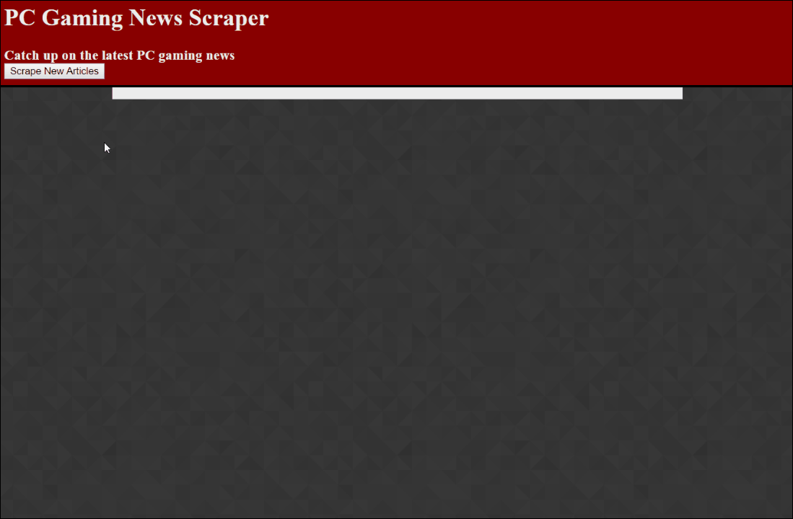
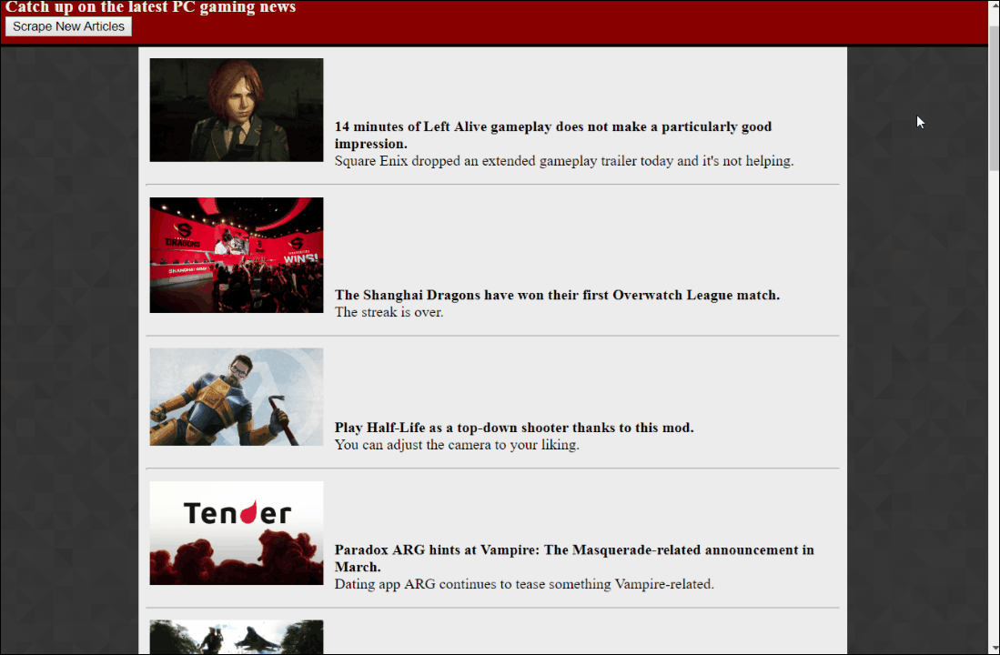
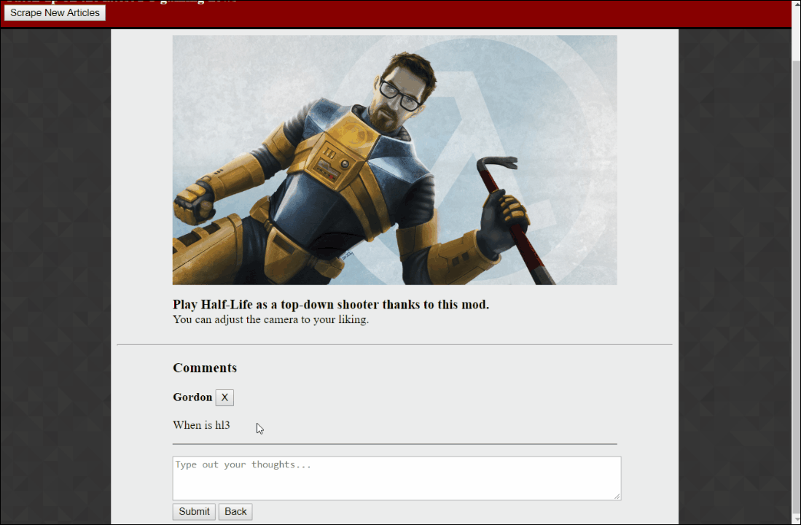

# PCGameNewsScraper
A web scraper collecting PC game related news utlizing the Mongoose ODM for a Mongo database.

The deployed site can be found [here](https://pcnewsscraper.herokuapp.com/).

Users can scrape for new articles when needed, and the articles will be added to the list.

Users can then click on an article to focus on it, be able to click on the title to be brought to the article, or leave a comment.  When leaving a comment, if the user hasn't previously entered a username they are prompted to do so.

Users can also delete comments they previously left on articles.

